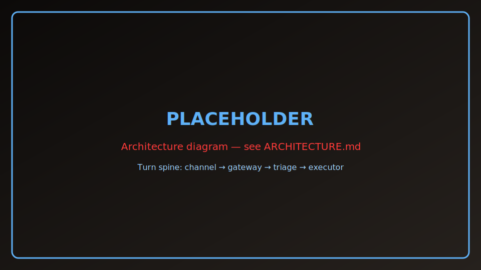

<!-- generated: do not edit by hand; run `sevn readme update root` -->

<a name="readme-top"></a>

<div align="center">

<picture>
  <source media="(prefers-color-scheme: dark)" srcset="styles/sevn/style/logos/logo-all-white.svg">
  
</picture>

<p align="center">
<em>
I'm Sevn. I'm more than a bot,<br>
or an Assistant, AI or not.<br>
I'm Sevn, I can be what you want,<br>
Agentic, attentive, shaped to your intent.<br>
I'm not perfect, I know, but I'm working on it,<br>
I will get better every day, as we keep turning it.<br>
Mostly Python, but also a harness,<br>
a model or many, to serve you or somebody.<br>
Tools when you need hands, quiet when you don't,<br>
Your gateway, your rules — I run where you chose.<br>
</em>
</p>

[![Docs][docs-badge]][docs-link]
[![Quick Start][quick-badge]][quick-link]
[![Architecture][arch-badge]][arch-link]
[![Report Bug][bug-badge]][bug-link]

[![CI][ci-badge]][ci-link]
[![License: MIT][license-badge]][license-link]
[![Python 3.12+][python-badge]][python-link]
[![Package][package-badge]][package-link]


</div>

> [!NOTE]
> Hero image is a **placeholder** until real product media lands (see `docs/brand/assets/MANIFEST.md`).

---

sevn.bot — ownable multi-channel AI assistant

<details>
<summary><strong>Table of contents</strong></summary>

- [Highlights](#highlights)
- [Architecture at a glance](#architecture-at-a-glance)
- [Subsystem map](#subsystem-map)
- [Quick start](#quick-start-tldr)
- [Security model](#security-model)
- [Install](#install)
- [Docs by goal](#docs-by-goal)
- [Community](#community)
- [License](#license)
- [Acknowledgements](#acknowledgements)

</details>

## Highlights

- ![feature][feature-badge] Chat on Telegram, in your browser, or by voice — one assistant, many ways to reach it
- ![feature][feature-badge] Runs on your machine — you choose the AI models and keep control of your data
- ![feature][feature-badge] Remembers context across conversations so you do not have to repeat yourself
- ![feature][feature-badge] Built-in safety checks help catch risky requests before they run
- ![feature][feature-badge] Mission Control dashboard shows what Sevn is doing and lets you steer active tasks
- ![feature][feature-badge] Automations and scheduled triggers can run work even when you are not chatting
- ![feature][feature-badge] Grows with you through skills, tools, and workspace memory you control

## Architecture at a glance



- Turn spine: channel → gateway → triage → executor → tools/skills → reply
- Secrets and LLM calls route through the paired egress proxy
- Workspace-scoped memory and configurable tracing sinks

See [README catalog](docs/readmes/INDEX.md) and [Architecture](about-sevn.bot/ARCHITECTURE.md).

## Subsystem map

| Subsystem | Profile | Summary |
|-----------|---------|---------|
| [Gateway](docs/readmes/gateway.md) | `subsystem` | FastAPI control plane: channels, sessions, turn spine, queue/steer, Telegram menus. |
| [Agent runtime](docs/readmes/agent.md) | `subsystem` | Triager, tier-B/C executors, harness discipline, sandboxes, and turn orchestration. |
| [Channels](docs/readmes/channels.md) | `subsystem` | Telegram, Web UI bridge, voice hooks, and channel adapter patterns. |
| [Tools registry](docs/readmes/tools.md) | `catalog` | Curated inventory of @sevn_tool plugins, adapters, and permission gates. |
| [Skills system](docs/readmes/skills.md) | `catalog` | Curated inventory of bundled and workspace skills, loaders, and subprocess runners. |
| [Mission Control UI](docs/readmes/ui-mission-control.md) | `subsystem` | Dashboard SPA, tab registry, traces, ops surfaces, and OpenUI delivery. |
| [Security scanner](docs/readmes/security.md) | `subsystem` | LLM Guard, .llmignore, block-and-notify, and channel security copy. |
| [Secrets](docs/readmes/secrets.md) | `subsystem` | Secrets backends, logical keys, fingerprint confirmation — keys never in the gateway process. |
| [Egress proxy](docs/readmes/proxy-egress.md) | `subsystem` | Paired proxy daemon, /llm/* routes, Transport wire shapes, and session tokens. |
| [Tracing](docs/readmes/tracing.md) | `subsystem` | TraceSink, JSONL/SQLite/Logfire/OTel pipelines, and trace maintenance. |
| [Memory & context](docs/readmes/memory-context.md) | `subsystem` | LCM store, compaction, user model, dreaming, and Honcho opt-ins. |
| [Second brain](docs/readmes/second-brain.md) | `subsystem` | Wiki, Obsidian sync, ingest paths, and provenance for operator knowledge. |
| [Voice](docs/readmes/voice.md) | `subsystem` | Gateway-level STT/TTS chains, trigger keywords, and voice trace events. |
| [Non-interactive triggers](docs/readmes/triggers.md) | `subsystem` | Webhooks, cron, dedupe, dispatcher, and notify-only automation. |
| [Config & workspace](docs/readmes/config-workspace.md) | `subsystem` | sevn.json schema, workspace layout, defaults, and layout validation. |
| [Storage](docs/readmes/storage.md) | `subsystem` | SQLite schema, migrations, D1 paths, and ActiveRunSnapshot persistence. |
| [Code understanding](docs/readmes/code-understanding.md) | `subsystem` | MYCODE, Graphify, code-review-graph, and CGR integration for repo orientation. |
| [Self-improvement](docs/readmes/self-improve.md) | `subsystem` | Self-upgrade harness, eval workers, spec-kit stages, and improve jobs. |
| [Integrations](docs/readmes/integrations.md) | `subsystem` | Cursor Cloud, GitHub skill clients, and external integration call paths. |
| [Onboarding](docs/readmes/onboarding.md) | `guide` | Operator setup: CLI, web wizard, Telegram flows, daemon install, and profiles. |

<a id="quick-start-tldr"></a>

## Quick start

**Clone and onboard**

```bash
git clone https://github.com/sevn-bot/sevn.git
cd sevn
make setup
sevn onboard
sevn doctor
```

`make setup` syncs dependencies, installs pre-commit hooks, and puts the `sevn` CLI on your PATH (via uv). Do **not** hand-edit `sevn.json` for first-time setup — run **`sevn onboard`** (web wizard by default; `sevn onboard --cli` for the terminal UI). It writes workspace config, secrets, and optional daemon units.

After onboarding, use the **`sevn` CLI** for everyday operations: `sevn doctor`, `sevn gateway start`, `sevn sync --latest`, etc.

## Security model

Operator-owned gateway with paired egress proxy, secrets backends, and LLM Guard scanning. See [Security](docs/readmes/security.md) and [Secrets](docs/readmes/secrets.md).

## Install

1. Clone this repository
1. From the repo root, run **`make setup`** — installs **uv** when missing, fetches **Python 3.12+** via uv (see `.python-version`), syncs dependencies, and puts the `sevn` CLI on PATH
1. Run **`sevn onboard`** to configure your workspace (replaces manual `sevn.json` editing; installs gateway/proxy daemons by default)
1. Run **`sevn doctor`** to confirm the install is healthy

## Docs by goal

| Goal | Start here |
|------|------------|
| Run the gateway | [Gateway](docs/readmes/gateway.md) |
| Configure the workspace | [Config & workspace](docs/readmes/config-workspace.md) |
| Browse all READMEs | [INDEX](docs/readmes/INDEX.md) |

## Community

Issues and discussions: [GitHub](https://github.com/sevn-bot/sevn).

## License

MIT — see [LICENSE](LICENSE).

## Acknowledgements

Built on open-source tools documented throughout `docs/readmes/`.

<p align="right">(<a href="#readme-top">back to top</a>)</p>

[docs-badge]: https://img.shields.io/badge/Docs-5fb1f7?style=for-the-badge&logo=readthedocs&logoColor=white
[docs-link]: docs/readmes/INDEX.md
[quick-badge]: https://img.shields.io/badge/Quick_Start-5fb1f7?style=for-the-badge&logo=rocket&logoColor=white
[quick-link]: #quick-start-tldr
[arch-badge]: https://img.shields.io/badge/Architecture-2a7fc6?style=for-the-badge&logo=diagramsdotnet&logoColor=white
[arch-link]: about-sevn.bot/ARCHITECTURE.md
[bug-badge]: https://img.shields.io/badge/Report_Bug-ff3b3b?style=for-the-badge&logo=githubissues&logoColor=white
[bug-link]: https://github.com/sevn-bot/sevn/issues
[ci-badge]: https://img.shields.io/badge/CI-6a9c78?style=for-the-badge&logo=githubactions&logoColor=white
[ci-link]: .github/workflows/ci.yml
[license-badge]: https://img.shields.io/badge/License-MIT-5fb1f7?style=for-the-badge
[license-link]: LICENSE
[python-badge]: https://img.shields.io/badge/Python-3.12+-2a7fc6?style=for-the-badge&logo=python&logoColor=white
[python-link]: pyproject.toml
[package-badge]: https://img.shields.io/badge/package-0.0.1-c89a52?style=for-the-badge
[package-link]: pyproject.toml
[feature-badge]: https://img.shields.io/badge/-5fb1f7?style=flat-square
