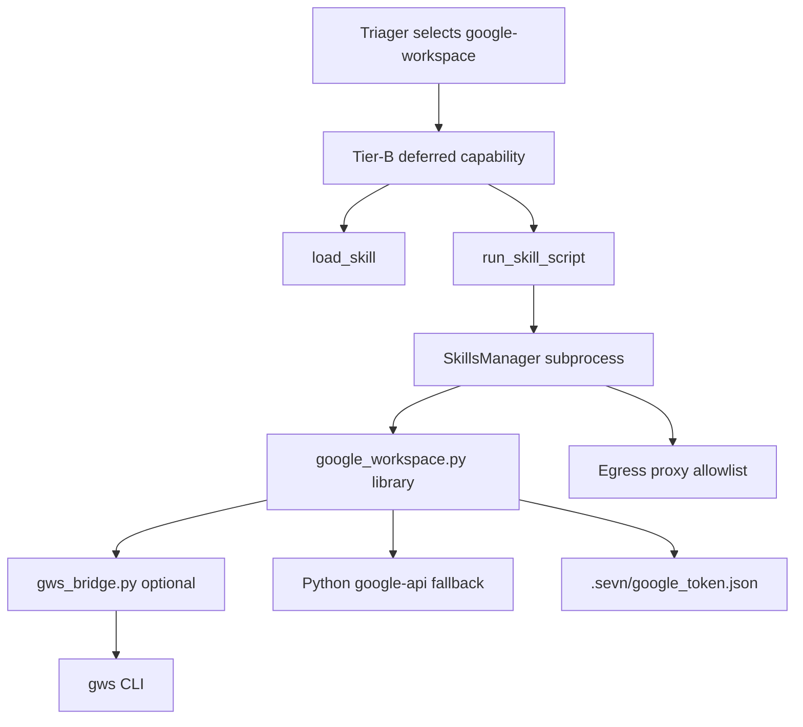

# Google Workspace skill — Spec

## 1. Goal

Deliver **Hermes Agent google-workspace parity** as a sevn **bundled core skill** (`google-workspace`), covering Gmail, Calendar, Drive, Sheets, Docs, and Contacts through OAuth2-authenticated Google APIs.

Reference implementation: [Hermes `skills/productivity/google-workspace/`](https://github.com/NousResearch/hermes-agent/tree/main/skills/productivity/google-workspace) (v1.1+ with optional [`gws` CLI](https://github.com/googleworkspace/cli) backend).

Operator-facing function catalog: [`google-workspace.html`](../google-workspace.html) (help site).

## 2. Gap analysis — Hermes vs sevn today

| Area | Hermes google-workspace | sevn today |
|------|-------------------------|------------|
| Gmail read/search | OAuth + Gmail API (`gmail search`, `gmail get`) | Browser recipe `browser` → `gmail` (`list`, `read`, `search`); `email-management` IMAP live |
| Gmail send/reply | OAuth API (`gmail send`, `gmail reply`, labels) | Browser gated writes; `email-management` SMTP |
| Gmail labels | `gmail labels`, `gmail modify` | Not implemented |
| Calendar | list/create/delete | Not implemented |
| Drive | search/get/upload/download/folder/share/delete | Not implemented |
| Sheets | create/get/update/append | Not implemented |
| Docs | get/create/append | Not implemented |
| Contacts | list | Not implemented |
| OAuth setup | Agent-driven PKCE flow (`setup.py`) | Not implemented (IMAP app passwords only) |
| Backend | `gws` preferred, Python fallback | CDP scraping + IMAP |

**Conclusion:** sevn covers Gmail **read** via browser and **email-only** via IMAP. Full Workspace API coverage requires a new skill; browser paths remain as fallbacks when OAuth is unavailable.

## 3. Architecture (sevn-adapted)



### 3.1 Skill layout

```
src/sevn/data/bundled_skills/core/google-workspace/
├── SKILL.md
├── references/
│   └── gmail-search-syntax.md
└── scripts/
    ├── setup.py              # OAuth PKCE (check, client-secret, auth-url, auth-code, revoke)
    ├── google_api.py         # Hermes-compatible CLI: gmail|calendar|drive|...
    └── gws_bridge.py         # Token refresh → GOOGLE_WORKSPACE_CLI_TOKEN for gws
```

Shared library (testable, no subprocess in unit tests):

```
src/sevn/skills/google_workspace.py
```

### 3.2 Credential storage (sevn conventions)

| Artifact | Path | Notes |
|----------|------|-------|
| OAuth token | `<workspace>/.sevn/google_token.json` | Auto-refresh; never returned in script JSON |
| Client secret | `<workspace>/.sevn/google_client_secret.json` | Operator supplies once |
| Pending PKCE | `<workspace>/.sevn/google_oauth_pending.json` | Ephemeral until exchange |
| Last auth URL | `<workspace>/.sevn/google_oauth_last_url.txt` | Operator handoff aid |

Env overrides (optional): `SEVN_GOOGLE_TOKEN_PATH`, `SEVN_GOOGLE_CLIENT_SECRET_PATH`.

### 3.3 Execution backend

1. **Preferred:** [`gws`](https://github.com/googleworkspace/cli) when on PATH — `gws_bridge.py` injects refreshed token via `GOOGLE_WORKSPACE_CLI_TOKEN`.
2. **Fallback:** bundled Python client (same JSON output contract as Hermes `google_api.py`).
3. **Degraded:** triager may still route Gmail reads to `browser` gmail recipe or `email-management` when skill reports `NOT_AUTHENTICATED`.

### 3.4 Config (`sevn.json`)

```json
{
  "skills": {
    "google_workspace": {
      "enabled": true,
      "prefer_gws": true,
      "default_services": "all",
      "account_label": "Primary Google",
      "dry_run": false
    }
  }
}
```

Typed section: `GoogleWorkspaceSkillConfig` in `src/sevn/config/sections/skills_google_workspace.py`.

### 3.5 Egress

Skill manifest `egress:`:

- `gmail.googleapis.com`
- `www.googleapis.com`
- `oauth2.googleapis.com`
- `people.googleapis.com`
- `sheets.googleapis.com`
- `docs.googleapis.com`
- `drive.googleapis.com`
- `calendar.googleapis.com`

### 3.6 Security and operator gates

| Operation class | Gate |
|-----------------|------|
| Read (search, get, list) | Allowed after auth check |
| Send email, create calendar, upload/share/delete drive, sheets update, docs append | **Ask operator first**; scripts set `abortable: false` where Hermes rules require confirmation |
| OAuth setup | Operator-driven; agent sends URLs, never stores client secret in chat |
| Token material | Redacted in traces; SkillSpector scans scripts |

Hermes rules 1–5 carry over verbatim in `SKILL.md` body.

## 4. Function inventory (Hermes parity)

All commands flow through `scripts/google_api.py` with JSON stdout (`write_ok` / `write_error` from `sevn.lcm.script_cli`).

### 4.1 Setup (`scripts/setup.py`)

| Command | Purpose |
|---------|---------|
| `--check` | `AUTHENTICATED` / `NOT_AUTHENTICATED` / partial scopes |
| `--client-secret PATH` | Store Desktop OAuth client JSON |
| `--auth-url [--services …]` | PKCE auth URL (json or plain) |
| `--auth-code CODE_OR_URL` | Exchange code; refresh on expiry |
| `--revoke` | Revoke and delete token |
| `--install-deps` | Install optional Python deps |

Service sets: `email`, `calendar`, `drive`, `sheets`, `docs`, `contacts`, `all`.

### 4.2 Gmail

| Command | Write? |
|---------|--------|
| `gmail search QUERY [--max N]` | No |
| `gmail get MESSAGE_ID` | No |
| `gmail send --to --subject --body [--html] [--from] [--cc]` | Yes |
| `gmail reply MESSAGE_ID --body [--from]` | Yes |
| `gmail labels` | No |
| `gmail modify MESSAGE_ID --add-labels/--remove-labels` | Yes |

### 4.3 Calendar

| Command | Write? |
|---------|--------|
| `calendar list [--start ISO] [--end ISO]` | No |
| `calendar create --summary --start --end [--location] [--attendees]` | Yes |
| `calendar delete EVENT_ID` | Yes |

### 4.4 Drive

| Command | Write? |
|---------|--------|
| `drive search QUERY [--max N] [--raw-query]` | No |
| `drive get FILE_ID` | No |
| `drive upload PATH [--name] [--parent]` | Yes |
| `drive download FILE_ID [--output] [--export-mime]` | No |
| `drive create-folder NAME [--parent]` | Yes |
| `drive share FILE_ID --email/--type/--role [--notify]` | Yes |
| `drive delete FILE_ID [--permanent]` | Yes |

### 4.5 Contacts

| Command | Write? |
|---------|--------|
| `contacts list [--max N]` | No |

### 4.6 Sheets

| Command | Write? |
|---------|--------|
| `sheets create --title [--sheet-name]` | Yes |
| `sheets get SHEET_ID RANGE` | No |
| `sheets update SHEET_ID RANGE --values JSON` | Yes |
| `sheets append SHEET_ID RANGE --values JSON` | Yes |

### 4.7 Docs

| Command | Write? |
|---------|--------|
| `docs get DOC_ID` | No |
| `docs create --title [--body]` | Yes |
| `docs append DOC_ID --text TEXT` | Yes |

Full usage table: [`google-workspace.html`](../google-workspace.html).

## 5. Agent consumption (sevn skills system)

1. Triager adds `google-workspace` to `TriageResult.skills` for mail/calendar/drive/sheets/docs intents.
2. Tier-B attaches deferred capability `google-workspace__run_skill_script`.
3. Agent calls `load_skill("google-workspace")` → receives `capabilities[]` from `SKILL.md` scripts + prose.
4. Agent invokes e.g. `run_skill_script("google-workspace", "scripts/google_api.py", ["gmail", "search", "is:unread", "--max", "10"])`.

**Email-only triage:** prefer `email-management` (IMAP, no Cloud project) unless Calendar/Drive/Sheets/Docs are needed — same guidance as Hermes/himalaya split.

## 6. Relationship to existing integrations

| Existing | After google-workspace ships |
|----------|------------------------------|
| `email-management` | Keep for multi-account IMAP/SMTP and non-Google mail; Gmail API dry-run plans migrate to live calls via shared helpers or deprecation notice in SKILL.md |
| `browser` gmail recipe | Keep for operators without OAuth; document as fallback in google-workspace SKILL.md |
| `browser` google_search/maps/youtube | Unchanged; not part of this skill |

## 7. Implementation phases

### Phase 0 — Planning (this spec + help HTML)

- [x] Gap analysis and architecture
- [x] Function catalog HTML for operators and implementers
- [ ] Manifest entry in `_docsys/manifest.toml` (optional CI follow-up)

### Phase 1 — OAuth + auth library

- [ ] `src/sevn/skills/google_workspace.py` — paths, token load/refresh, scope sets
- [ ] `scripts/setup.py` — PKCE flow ported from Hermes, sevn path conventions
- [ ] Config section + egress registration
- [ ] Unit tests with fixture tokens (no network)

### Phase 2 — Core API (Python fallback)

- [ ] `scripts/google_api.py` — Gmail + Calendar read/write
- [ ] Drive search/get
- [ ] Contacts list
- [ ] JSON output contract tests (golden files)

### Phase 3 — Docs/Sheets + Drive writes

- [ ] Sheets create/get/update/append
- [ ] Docs get/create/append
- [ ] Drive upload/download/folder/share/delete

### Phase 4 — gws bridge

- [ ] `scripts/gws_bridge.py`
- [ ] `prefer_gws` config flag
- [ ] Doctor check: `sevn doctor` reports gws presence

### Phase 5 — Bundling and routing

- [ ] `SKILL.md` + `INDEX.md` row
- [ ] Triager routing hints (workspace template / AGENTS.md)
- [ ] Onboarding capability stub update (`onboarding_capabilities.json`)
- [ ] E2E test: setup dry-run + gmail search mock

## 8. Testing strategy

| Layer | Approach |
|-------|----------|
| Library | Mock HTTP / recorded responses |
| Scripts | Subprocess argv → JSON envelope assertions |
| gws bridge | Skip if gws absent; integration job optional |
| Agent E2E | `tests/agent/test_e2e_skill_execution.py` pattern with quarantine off for core |
| Security | SkillSpector baseline update; no token leakage in stdout |

## 9. Dependencies

- Optional: `google-api-python-client`, `google-auth-oauthlib` (install via `setup.py --install-deps`)
- Optional system: `gws` (`npm i -g @googleworkspace/cli` or Homebrew)
- No new MCP server required for v1 (future: expose gws MCP behind egress policy)

## 10. Open questions

1. **Unify with email-management?** Recommend separate skills: email-management = multi-provider IMAP; google-workspace = Google OAuth suite. Cross-link in both SKILL.md files.
2. **Workspace vs personal Google?** Same OAuth flow; document Advanced Protection / Workspace admin allowlist (Hermes troubleshooting table).
3. **Dry-run mode?** Follow email-management: `--dry-run` and `SEVN_GOOGLE_DRY_RUN=1` emit plan envelopes without API I/O.

## 11. Acceptance criteria

- [ ] Bundled `google-workspace` skill passes `scripts/check_skills_index.py`
- [ ] All functions in §4 callable via `run_skill_script` with Hermes-compatible JSON shapes
- [ ] OAuth setup completable from Telegram/webchat (URL handoff)
- [ ] Write operations blocked without operator confirmation in harness
- [ ] Help page `google-workspace.html` stays in sync with `SKILL.md` scripts
