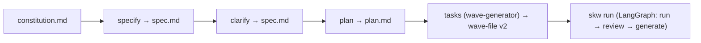

# Spec-kit standards in spec-kit-wave

This kit adopts [GitHub spec-kit](https://github.com/github/spec-kit)'s Spec-Driven Development
(SDD) standards as a **front end** to the deterministic wave-file v2 orchestration loop it
inherits from `build-plan-from-review`. The point is unchanged — plan, run waves, review, and
loop until review passes — but the plan is now produced through spec-kit's phase discipline, and
the wave-file stays format v2 with spec-kit task conventions folded in.

## The flow



## Phase ↔ stage mapping

| spec-kit command | spec-kit-wave phase | Artifact | Command |
|------------------|---------------------|----------|---------|
| `/speckit.constitution` | governing principles | `constitution.md` | `make constitution` |
| `/speckit.specify` | `specify` (front end) | `spec/<slug>/spec.md` | `make specify SLUG= TITLE= [CONTEXT=] [PATHS=]` |
| `/speckit.clarify` | `clarify` (front end) | `spec/<slug>/spec.md` Clarifications | `make clarify SLUG= TITLE=` |
| `/speckit.plan` | `plan` (front end) | `spec/<slug>/plan.md` | `make plan SLUG= TITLE=` |
| `/speckit.tasks` | `tasks` = wave-generator | `waves/<slug>-wave-plan.md` (v2) | `make tasks SLUG= TITLE=` |
| `/speckit.analyze` + `/speckit.checklist` | reviewer + `problem-types.md` | `review-result.json` | `make reviewer WAVE=` |
| `/speckit.implement` | wave-runner + loop | branch commits | `make loop WAVE=` |

Each front-end phase also has a headless `-run` variant (`make specify-run …`, etc.) that
dispatches the rendered prompt through `scripts/agent.sh`.

## What each standard maps to

- **Constitution** ([`constitution.md`](constitution.md)) — spec-kit's foundational standard.
  Binding principles that the `plan` phase checks (Constitution Check) and the **reviewer**
  enforces on the branch diff (a MUST-violation ⇒ `changes_required`), alongside the review
  plugin (default: thermo).
- **Spec** ([`spec-templates/spec-template.md`](spec-templates/spec-template.md)) — prioritized,
  independently testable user stories (US1, US2, …), functional requirements, success criteria.
- **Clarify** — structured disambiguation of the spec before planning; records answers in a
  `## Clarifications` section.
- **Plan** ([`spec-templates/plan-template.md`](spec-templates/plan-template.md)) — tech stack,
  architecture, Constitution Check, and the `make` verify targets waves will run.
- **Tasks** ([`wave-plan-template.md`](wave-plan-template.md)) — the wave-file v2. spec-kit task
  conventions are folded in:
  - waves/bullets **grouped by user story**, tagged `[US1]`, `[US2]`, …;
  - bullets with no ordering dependency across different files tagged `[P]` (parallel);
  - **tests-first** ordering via the single `role = test-author` wave (RED before GREEN) — the
    `test-creator` agent confirms seams before writing any test and avoids the three anti-patterns
    (implementation-coupled, tautological, horizontal-slicing); see
    [`agents/test-creator.md`](agents/test-creator.md) / [`prompts/test-creator.md`](prompts/test-creator.md);
  - optional `[spec]` TOML table recording `constitution`/`spec`/`plan` provenance (ignored by
    the validator).
- **Implement** — the existing LangGraph loop (`skw run`): per-wave run → verify → commit →
  optional review gate, then branch review and (on failure) a new remediation wave-file.

## Vocabulary cross-links

This document owns the spec-kit phase vocabulary: **spec**, **wave**, **user story**. Two kit
skills introduce adjacent-but-distinct vocabulary — cross-link rather than redefine, so terms
don't collide across roles:

- [`skills/codebase-design/SKILL.md`](skills/codebase-design/SKILL.md) owns **module / interface /
  seam** — the design vocabulary `specify` uses for its Seams section ("prefer existing seams; use
  the highest seam possible; ideal new-seam count = 1") and that the `reviewer`'s Standards-axis
  smell baseline reasons about (see [`agents/references/smells.md`](agents/references/smells.md)).
  A *seam* is where a module's interface lives — not a *wave* (an orchestrated unit of work) or a
  *user story* (a spec-kit planning artifact).
- [`skills/domain-modeling/SKILL.md`](skills/domain-modeling/SKILL.md) owns **ubiquitous
  language** — domain-concept vocabulary recorded in `about-sevn.bot/GLOSSARY.md` (resolved via
  `skw.toml [context]`, see `scripts/context_paths.py`) that spec/plan/wave-file prose should
  reuse for naming. It names *domain concepts*, distinct from the spec-kit phase names (spec,
  plan, tasks) above.

## Typical workflow

```bash
make constitution                                  # review/ratify principles (edit constitution.md)
make specify-run  SLUG=my-feature TITLE="My feature" CONTEXT=brief.md PATHS=src/foo
make clarify-run  SLUG=my-feature TITLE="My feature"
make plan-run     SLUG=my-feature TITLE="My feature"
make tasks-run    SLUG=my-feature TITLE="My feature"   # wave-generator → waves/my-feature-wave-plan.md
make validate WAVE=waves/my-feature-wave-plan.md
make loop     WAVE=waves/my-feature-wave-plan.md       # run → review → (generate) → loop
```

You can skip phases for small changes (author the wave-file directly with `make new` /
`make tasks`), but the constitution and the tests-first wave still apply.

## PRD standard (product layer)

PRDs under `about-sevn.bot/prd/` are the **product intent** layer that feeds
`/speckit.specify`. The kit owns the template and validator until rewrites land
repo-wide.

| Artifact | Path |
|----------|------|
| Standards | [`PRD-STANDARDS.md`](PRD-STANDARDS.md) |
| Agent | [`agents/prd-author.md`](agents/prd-author.md) · [`.cursor/agents/prd-author.md`](../.cursor/agents/prd-author.md) |
| Template | [`prd-templates/prd-template.md`](prd-templates/prd-template.md) |
| Rules | [`prd-templates/prd-rules.toml`](prd-templates/prd-rules.toml) |
| Spec EARS patterns | [`spec-templates/acceptance-criteria-ears.md`](spec-templates/acceptance-criteria-ears.md) |

```bash
make prd-author-run PRD=about-sevn.bot/prd/05-cost-and-providers.md [PROFILE=ai-native]
make prd-validate PRD=about-sevn.bot/prd/05-cost-and-providers.md
make prd-check    # all PRDs under PRD_DIR (default ../about-sevn.bot/prd)
```

**Profiles:** `prd_profile: standard` (default) or `ai-native` (eval, degradation,
confidence — for agent/self-improvement PRDs). **Brownfield spec edits** use OpenSpec-style
`ADDED|MODIFIED|REMOVED` tokens in the PRD Change Log; normative **shall** criteria stay in
specs (EARS/GEARS — see acceptance-criteria template).

## Verification scaffolding (special agent)

One-time setup to generate a repo-specific **`/verify`** skill (per-task proof-before-PR).
Adapted from [AI-Builder-Club/skills verifier-setup](https://github.com/AI-Builder-Club/skills/blob/main/skills/verifier-setup/SKILL.md).

| Artifact | Path |
|----------|------|
| Setup skill | [`skills/verifier-setup/SKILL.md`](skills/verifier-setup/SKILL.md) |
| Verify template | [`skills/verifier-setup/assets/verify.template.md`](skills/verifier-setup/assets/verify.template.md) |
| Agent | [`agents/verifier-setup.md`](agents/verifier-setup.md) · [`.cursor/agents/verifier-setup.md`](../.cursor/agents/verifier-setup.md) |
| Generated output | `.cursor/skills/verify/SKILL.md` + `.claude/skills/verify/SKILL.md` |

```bash
make -C spec-kit-wave install-skills          # symlink kit skills into IDE hosts
make -C spec-kit-wave verifier-setup-run      # headless one-time scaffold
# then per task (after setup):
# /verify  — or load the generated verify skill before opening a PR
```

Install **`verifier-setup`** and the generated **`verify`** skill into Cursor/Claude Code via
`make install-skills` (symlink) or `COPY=1` (copy). The setup agent inventories sevn defaults
(`make compose-up`, `cursor-ide-browser`, `telegram_test`, `make ci-affected`).

## GitHub issue triage (special agent)

Maintainer-safe triage of the GitHub Issues queue: fetch, classify, draft comments, apply
metadata updates (dry-run first), and route actionable work into new or existing wave plans.
Adapted from
[JSONbored/awesome-claude github-community-issue-triage-agent](https://github.com/JSONbored/awesome-claude/blob/main/content/agents/github-community-issue-triage-agent.mdx)
and [mergisi/awesome-openclaw-agents github-issue-triager](https://github.com/mergisi/awesome-openclaw-agents/tree/main/agents/development/github-issue-triager).

| Artifact | Path |
|----------|------|
| Triage skill | [`skills/github-issue-triage/SKILL.md`](skills/github-issue-triage/SKILL.md) |
| Policy | [`skills/github-issue-triage/references/triage-policy.md`](skills/github-issue-triage/references/triage-policy.md) |
| Wave brief template | [`skills/github-issue-triage/assets/issue-wave-brief.template.md`](skills/github-issue-triage/assets/issue-wave-brief.template.md) |
| Agent | [`agents/github-issue-triage.md`](agents/github-issue-triage.md) · [`.cursor/agents/github-issue-triage.md`](../.cursor/agents/github-issue-triage.md) |

```bash
make -C spec-kit-wave install-skills
make -C spec-kit-wave github-issue-triage ISSUE=21
make -C spec-kit-wave github-issue-triage-run QUEUE=1
```

Paths resolve from `skw.toml [github]` via `scripts/context_paths.py` (never hardcoded in the skill).
Wave output defaults to `.ignorelocal/waves/`; validate with `make validate WAVE=…` before dispatch.
